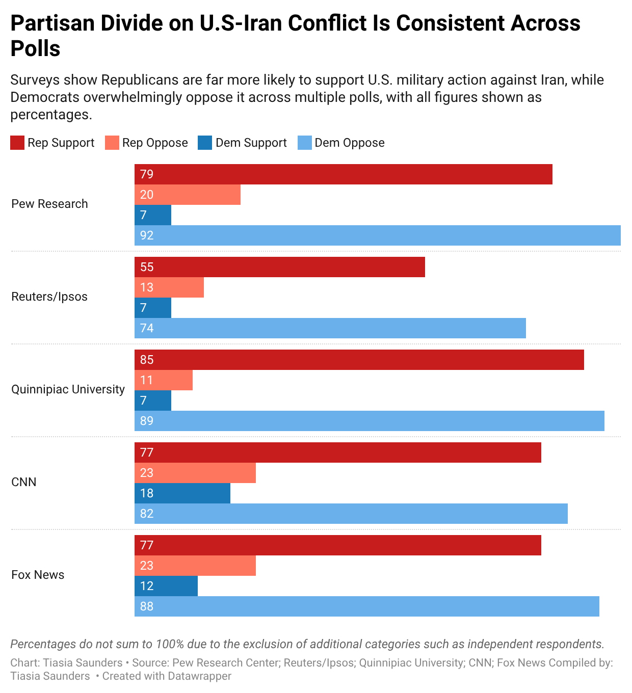
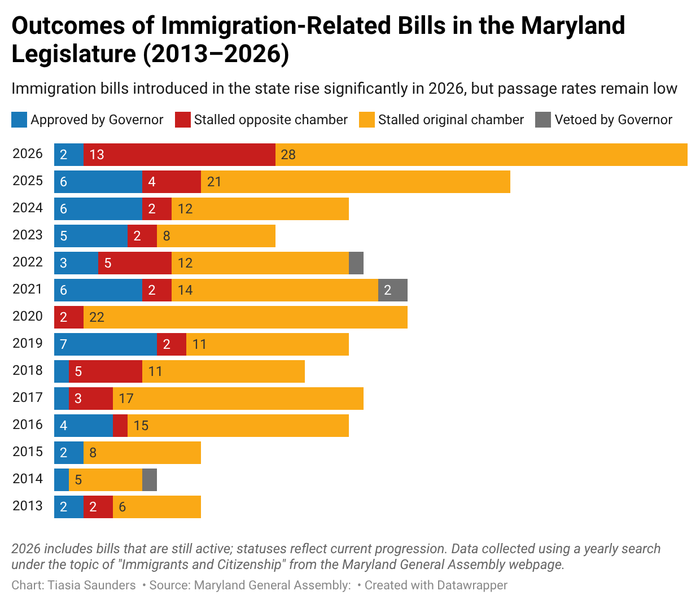
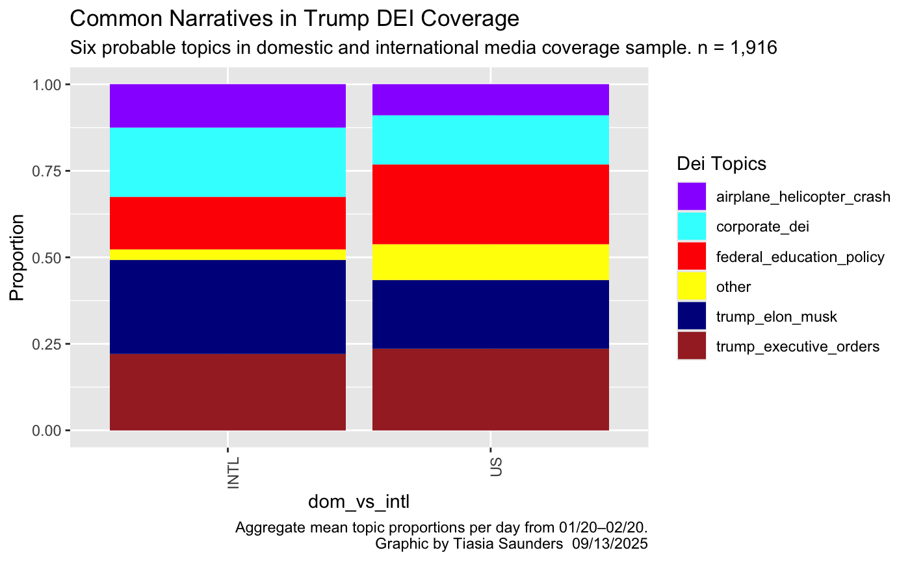
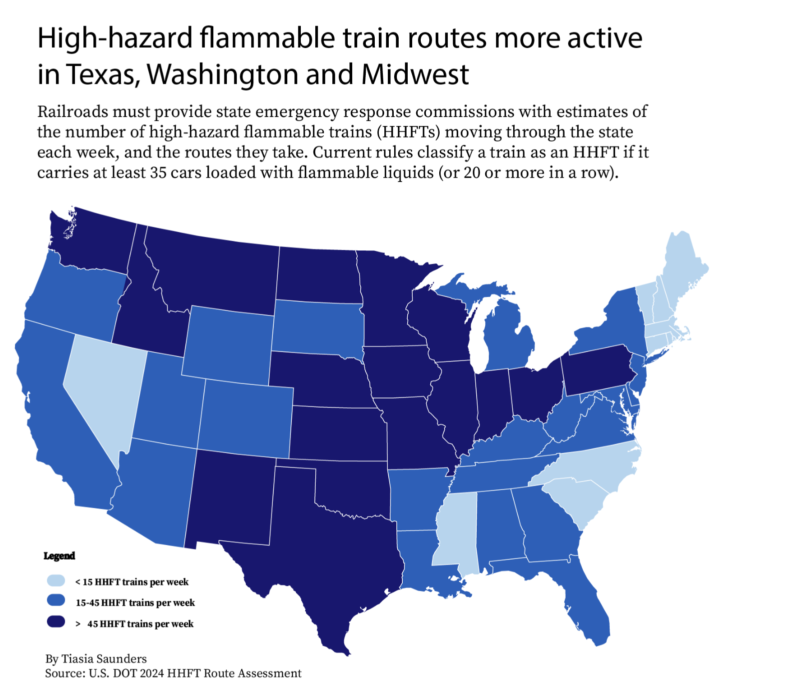

# Tiasia Saunders's Portfolio 

### Professional Summary: 
##### Howard University honors graduate and current fellow and graduate student at the Howard Center for Investigative Journalism at the University of Maryland. Additionally, a Data Journalist for the Capital News Service at UMD. Experienced in investigative and data-driven reporting with a focus on racial and socioeconomic disparities. Skilled in R, data visualization, and digital storytelling. Passionate about uncovering and telling powerful stories using data analysis, coding, and visualization tools.

### Technical Skills:
#### Programming & Analysis: R, SQL, Excel
#### Data Visualization: Datawrapper, Flourish
#### Web Development: HTML, CSS, JavaScript

## Education 
- M.J., Master's of Professional Journalism (specializing in Data Journalism) | University of Maryland | (_May 2026_)
- B.A., Bachelor's of Arts in Media, Journalism and Film | Howard University | (_May 2024_)

## Work Experience 
**Data and Graphics Journalist @ Capital News Service (_January 2026 - Present_)** 
- Develop and publish  data-driven investigative stories 
- Analyzed and cleaned large public datasets using R, SQL, and Excel to uncover trends in racial, socioeconomic, and policy-related issues across Maryland
- Produced data-driven stories for publication by combining statistical analysis, investigative reporting, and public records
- Created interactive and static data visualizations using Datawrapper, Flourish, and ggplot2 to clearly communicate complex findings to a general audience
- Conducted original reporting by filing public records requests (FOIA) and synthesizing data with expert interviews

**Data Journalist Fellow @ Howard Center for Investigative Journalism (_August 2024- Present_)**
- Develop and publish  data-driven investigative stories 
- Learn web development, interactive design, and coding in languages such as JavaScript and Python
- Use R and Python for data analysis 
- Use HTML/ CSS for webpage development
- Contribute to innovative and impactful journalism

**Data Journalist Intern @ Howard Center for Investigative Journalism (_June 2025 - August 2025_)**
- Analyze PHMSA public docket comments using sentiment analysis, topic modeling, and other data analysis techniques
- Conduct fact-checking, source outreach, and background research for investigative reporting on hazardous rail infrastructure
- Create visualizations and data graphics to highlight patterns and safety concerns in rail projects
- Use R and Python for data analysis and exploratory research on emerging investigative topics
- Assist in early-stage story development by identifying trends and researching potential investigative leads
- Collaborate with reporters, editors, and data journalists to integrate computational methods into newsroom workflows

## Data Visualizations 

**How AI Misconduct Cases Can Take Different Paths** 
  

- Appeared in [Capital News Service](https://cnsmaryland.org/2026/04/30/how-ai-misconduct-cases-are-handled-across-maryland-campuses/), [Daily Record](https://thedailyrecord.com/2026/05/01/how-maryland-campuses-handle-ai-misconduct-cases/#:~:text=Across%20the%20Maryland%20university%20policies,often%20left%20to%20faculty%20judgment.), [Baltimore Fishbowl](https://baltimorefishbowl.com/stories/how-ai-misconduct-cases-are-handled-across-maryland-campuses/#:~:text=By%3A%20Tiasia%20Saunders.,whether%20a%20violation%20has%20occurred.), [Montgomery County Sentinal](https://www.thesentinel.com/communities/how-ai-misconduct-cases-are-handled-across-maryland-campuses/article_3a480937-e1dc-4792-94b6-1946ef993704.html)
- A flowchart that shows the two different paths AI misconduct cases can take.
- Tools: Canva 

**Partisan Divide on U.S-Iran Conflict Is Consistent Across Polls**

- Appeared in [Capital News Service](https://cnsmaryland.org/2026/04/07/polls-show-majority-of-americans-disapprove-of-iran-conflict-as-trump-defends-war-in-address/)
- Highlights multiple national polling surveys partisian divide results about the U.S-Iran conflict.
- Tools: Excel, Datawrapper

**Outcomes of Immigration-Related Bills in the Maryland Legislature (2013–2026)**
 

- Appeared in [Capital News Service](https://cnsmaryland.org/2026/04/07/maryland-braces-for-increased-immigration-enforcement-with-dozens-of-bills/)  
- A grouped bar chart that shows the outcome of Maryland immigration-related bills and the associated statuses for the count of bills for years 2013 - 2026. 
- Tools Excel, Datawrapper 

**Trump DEI Coverage: Domestic vs. International Narratives**
 

- Created for an in-progress academic paper on comparative media framing of DEI-related Trump coverage (targeting peer-reviewed publication).
-  Highlights global narrative divergence and thematic emphasis between domestic and foreign reporting.
-  Type: Comparative topic modeling visualization
- Tools: R (ggplot2), dplyr, tidytext

**What defines a high-hazard flammable train**

- Appeared in [Capital News Service](https://cnsmaryland.org/2025/08/13/apply-safety-rules-to-more-flammable-cargo-trains-lawmakers-urge/)
- An infographic visualizing regulatory and safety definitions of high-hazard flammable trains.
- Translates complex regulatory language into a clear visual format, highlighting inconsistencies in how high-hazard flammable trains are defined—especially in the context of recent rail accidents.
- Tools: Adobe Illustrator

**High-hazard flammable train routes more active in Texas, Washington, and Midwest**

- Appeared in [Capital News Service](https://cnsmaryland.org/2025/08/13/apply-safety-rules-to-more-flammable-cargo-trains-lawmakers-urge/)
- A geographic visualization showing active HHFT (High-Hazard Flammable Train) routes 
- Provides a clear visual of potential high-risk areas; supports investigative reporting on rail safety.
- Tools: Adobe Illustrator

[**2020 Maryland County Election Results and January 6 Participant Counts**](https://public.flourish.studio/visualisation/22808280/)

- Appeared in [Capital News Service](https://cnsmaryland.org/2025/05/09/pardoned-maryland-jan-6-participants-find-support-after-convictions/), [the Southern Maryland Chronicle](https://southernmarylandchronicle.com/2025/05/27/pardoned-maryland-jan-6-participants-find-support-after-convictions/), [Maryland Matters](https://marylandmatters.org/2025/05/26/pardoned-maryland-jan-6-participants-find-support-after-convictions/#:~:text=6%2C%202021%2C%20insurrection%20at%20the,new%20acquaintances%20in%20his%20community.), and [the Balitmore Sun](https://www.baltimoresun.com/2025/05/26/pardoned-maryland-residents-jan-6-insurrection/)
- An interactive map comparing 2020 presidential vote shares in Maryland counties with the number of residents charged in the January 6 Capitol attack.
- Reveals geographic and political correlations in Maryland between voting behavior and post-election extremism.
- Compiled and merged election results with federal charging data to build a county-level dataset for analysis
- Tools: Flourish, R

[**Frederick County: A Battleground of Shifting Politics**](https://github.com/user-attachments/assets/fae20093-cb69-48cc-a1e8-fe5f970f1a21)

- Appeared in [Capital News Service](https://cnsmaryland.org/2025/05/09/pardoned-maryland-jan-6-participants-find-support-after-convictions/), [The Southern Maryland Chronicle](https://southernmarylandchronicle.com/2025/05/27/pardoned-maryland-jan-6-participants-find-support-after-convictions/), [Maryland Matters](https://marylandmatters.org/2025/05/26/pardoned-maryland-jan-6-participants-find-support-after-convictions/#:~:text=6%2C%202021%2C%20insurrection%20at%20the,new%20acquaintances%20in%20his%20community.), and [The Baltimore Sun](https://www.baltimoresun.com/2025/05/26/pardoned-maryland-residents-jan-6-insurrection/)
- A visual breakdown of political realignment in Frederick County, Maryland—tracking voter trends, demographic changes, and shifting party control
- Showcases nuanced, hyperlocal political changes in a swing county with growing electoral significance.
- Tools: Adobe Illustrator

## Projects 
- [Framing the Border: How CNN and Fox News Cover Trump and Immigration](https://t-cms.github.io/personal_code_projects/cj_final_project/trump_immigration_final_project/index.html)
- [Trump DEI Newspaper Analysis](https://t-cms.github.io/comp_text/trump_dei_final_project.html)
- [Pipeline and Hazardous Materials Safety Administration Docket 2019-0091/2025-0032 Comments' Analysis](https://t-cms.github.io/personal_code_projects/howard_center_work/phmsa_work/phmsa_comments_work.html)
- [NASA Pathways Program Demographic Analysis](https://t-cms.github.io/personal_code_projects/nasa_work/nasa_demographic_work.html)
- [ASVAB Testing Program Demographic Analysis](https://t-cms.github.io/personal_code_projects/asvab_work/asvab_work.html)

  
## Publications 
- [The Unsurprising Lack of DEIA in NASA's Pathways Program Hiring Patterns](https://scholarscompass.vcu.edu/semss_pubs/1/)
